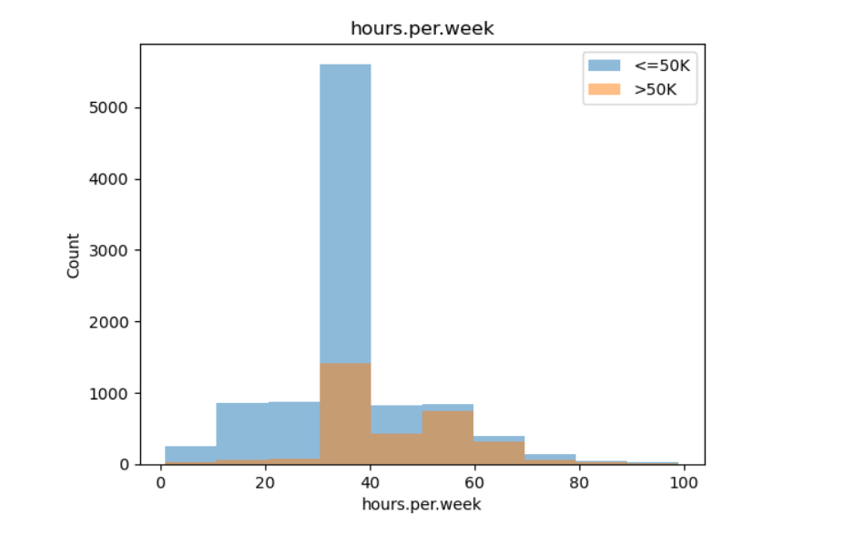
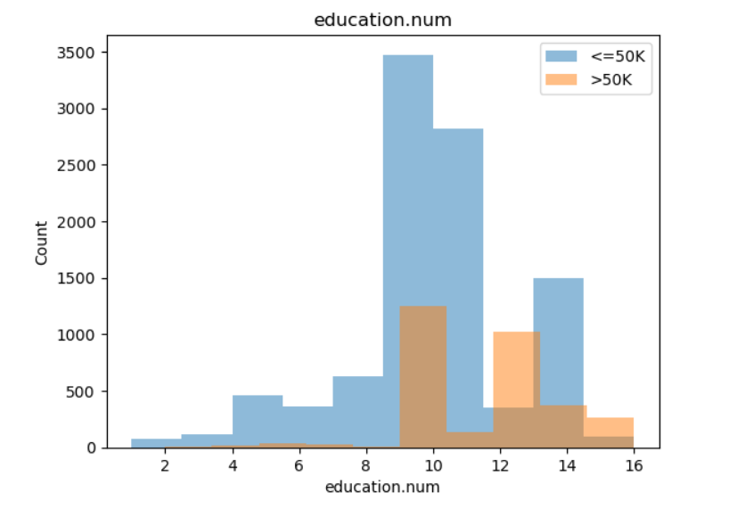
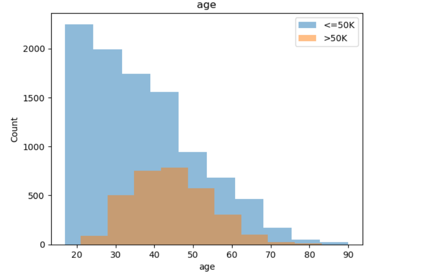

## **Predicting Income Levels from Census Data**

Income affects nearly every aspect of a person's living condition, such as the place they live, the opportunities they can have, and even how much free time they have. However, what actually influence someone's earning? To explore this question, I used a U.S. census dataset, which contains roughly 48,000 individuals, to investigate this problem. The dataset contains demographic and employment-related features such as age, education level, occupation, marital status, weekly and working hours. My goal was not to build the most complicated model, but simply to examine what features can be used to predict whether a person earning more then 50K per year 

## Exploring the Data

Before building any models, it is important to understand what kinds of patterns may exist in the data. After visualizing the data, some relationships are revealed. For instance, figure 1 shows that most of people who have income more than 50k are the people who work more hours per week. It can be observed from the figure that people who earn more than 50k rarely have a low work hours per week. However, the trend is not linear. Most of high income people works around 30 to 40 hours per week, but the extreme work hours tends to reduce the number of people who have high income.

 
Figure 1: Working Hours per Week vs. Income

Education showed a stronger separation. The dataset lists 16 different education categories, ranking from preschool to Doctorate degree. When mapping these categories by their natural order, the distribution of people with high income shows a clear pattern: people with advanced degrees were far more likely to reach an income above 50K. From the figure 2, it can be clearly observed that high income people mostly have a education level more than 9, which is high school graduates.

 
Figure 2: Education Number vs. Income

In addition, age also played a noticeable role. Younger individuals are more likely to fell into the less than 50K group. It can be observed from the figure 3 that under 20s, there are few people earning more than 50K. The number of high income people started to increase from 30s, and reach its max at 40s.

 
Figure 3: Age vs. Income

These visual patterns provided a sense of which features would likely be helpful for predictions.

